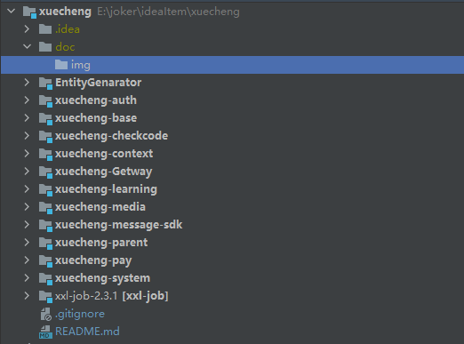
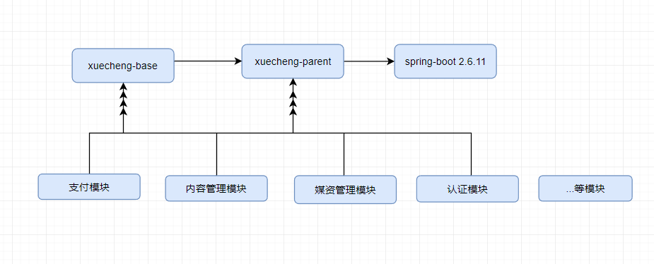
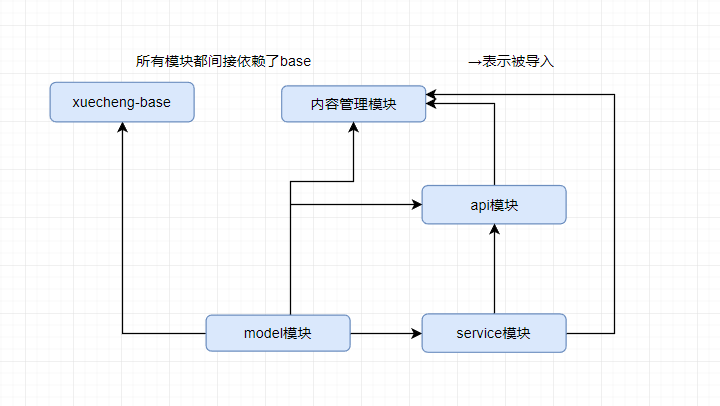

## 学成在线2.0 Java后端开发：

[学成后端](./README.md)

---


后端java项目结构：



推荐软件配置：

```
jdk8
IntelliJ IDEA 2021.3.2
VMware Workstation Pro
CentOs 7/8
docker
rabbitmq
redis
mysql 8.0+
PostMan
nacos	
Navicat 15 for MySQL
Xshell
```

### 使用到的后端技术栈：

**后端技术栈：**
	springboot:作为启动项以及项目api接口；

​	spring-security集成oauth2.0作为登录服务器发放token；

​	mybatis整合mybatis-plus 作为数据库连接以及domain生成插件；

​	nacos作为注册中心用于微服务的远程调用；

​	文件系统没有采用minIO,而是保存到本地；

​	采用Gateway作为后端网关配置；

​	redis作为缓存，用于高并发的数据查询。


### 涉及到的模块共有：

​	[基础的内容显示模块](./doc/projectDoc/content.md)

​	[支付模块](./doc/projectDoc/pay.md)

​	[验证码模块](./doc/projectDoc/checkcode.md)

​	[媒资管理模块](./doc/projectDoc/media.md)

​	[学习中心模块](./doc/projectDoc/learn.md)

​	

### 基础模块的依赖关系：




### 模块内部的依赖关系：




项目模块完成周期14天。

文档编写耗时：


感谢黑马程序员提供的项目背景，以及文档文件。


