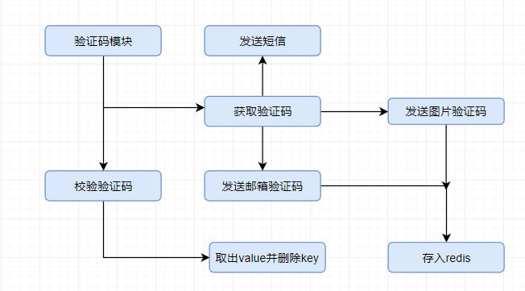
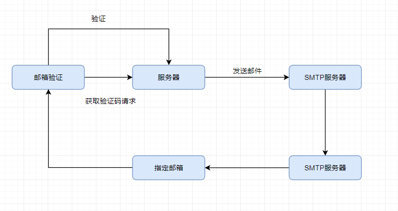

# 验证码模块：

一个微服务，用于验证，验证结果为true表示验证码正确。

模块的结构：




验证码种类很多：普通的图片验证码，短信验证码，邮箱验证码，以及邮箱验证路径。

验证分为登录验证和路径自动验证。

本质上一个是将验证码消息添加到登录信息中，一个是调用api完成。


验证码的生成服务：

```
请求参数设计：
checkCodeType: //pic图片类型：
				//sms 短信类型
				// email 邮箱类型
```

将返回：

```
checkcode:   //验证码实体
checkcodekey: //唯一标识
aliasing:   //混淆内容： 如图像验证码的图像
```


生成的验证码保存在内存中，在经过一次验证后将在内存中删除，且设置过期时间。

后期可以单独配置Redis缓存，暂时使用本地作为验证。


## 图像验证码：

依赖文件：

```xml
        <dependency>
            <groupId>commons-codec</groupId>
            <artifactId>commons-codec</artifactId>
        </dependency>
        <dependency>
            <groupId>com.github.penggle</groupId>
            <artifactId>kaptcha</artifactId>
            <version>2.3.2</version>
        </dependency>
```

图像验证码是通过Base64 获得的.png文件；

配置Kaptcha生成图形验证码：

```java
    @Bean
    public DefaultKaptcha producer() {
        Properties properties = new Properties();
        properties.put("kaptcha.border", "no"); //是否有边界
        properties.put("kaptcha.textproducer.font.color", "black"); //字体颜色
        properties.put("kaptcha.textproducer.char.space", "10");	//
        properties.put("kaptcha.textproducer.char.length","4");		//验证码长度
        properties.put("kaptcha.image.height","34");				
        properties.put("kaptcha.image.width","138");
        properties.put("kaptcha.textproducer.font.size","25");		//字体大小

        properties.put("kaptcha.noise.impl","com.google.code.kaptcha.impl.NoNoise");
        Config config = new Config(properties);
        DefaultKaptcha defaultKaptcha = new DefaultKaptcha();
        defaultKaptcha.setConfig(config);
        return defaultKaptcha;
    }

//注入DefaultKaptcha 
 
//执行：BufferedImage image = kaptcha.createImage(code); 
//字节数组输入输出流将 图片转换为 Base64编码
```


## 短信验证码：

sms服务尚未了解。


## 邮箱验证码：

考虑邮箱验证只需要验证code本身不需要key,用redis存放。

邮箱验证过程：


