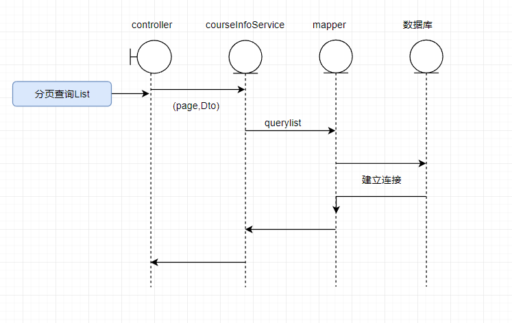

# 内容管理模块：


## 课程管理：

课程基本表：


### 分页查询表并拿到结果：


流程图：




```
Post /course/list? pageNo=1&pageSize=10
{
"auditStatus": "",
"courseName": "",
"publishStatus":""
}
response: PageResult<CourseBase> 
返回课程的基本信息
可以根据课程名称模糊查询，选择审核类型，以及发布状态查询；
```

结果：


### 新建课程：


新建课程需要填写课程基本表，课程营销计划表，课程计划，课程老师涉及到多个表的插入数据因此将步骤拆分成多个插入计划。

由于课程基本表和课程营销表都是唯一的，所有他们的主键是一致的。

因此添加课程的流程：

​	1.点击添加课程后选择课程的类型(直播，录播)；

​	2.填写课程基本表信息以及营销信息，发起插入请求，保存并进行下一步；

​	3.创建课程计划，如章节内容，媒资绑定/直播预计时间，免费/收费，保存并进行下一步；

​	4.添加课程教师信息，点击保存，流程结束。

即可分为四个表的增删改查,根据Restful风格的代码可以将：

​	Post 增，Get 查，Put 改，Delete 删


### 预览课程：


### 发布课程：


### 下架课程：


### 删除课程：