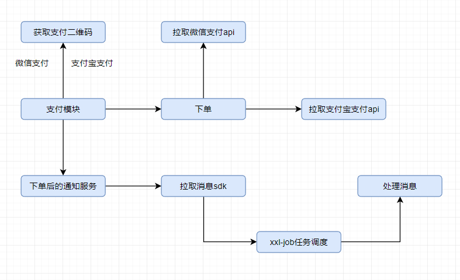
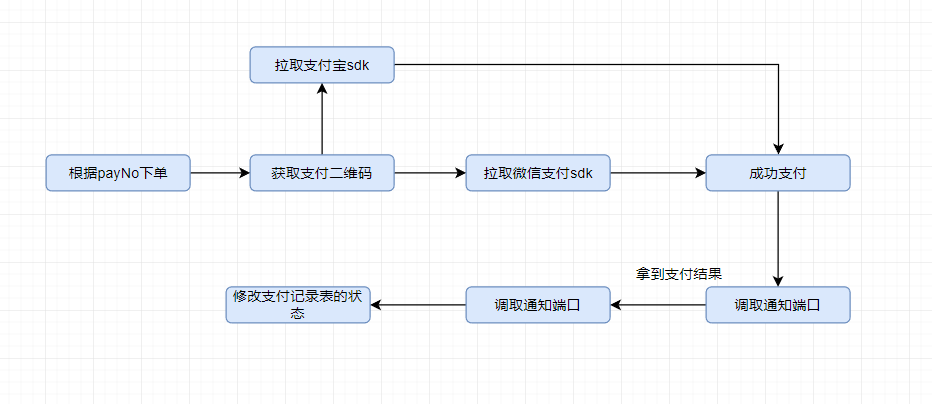
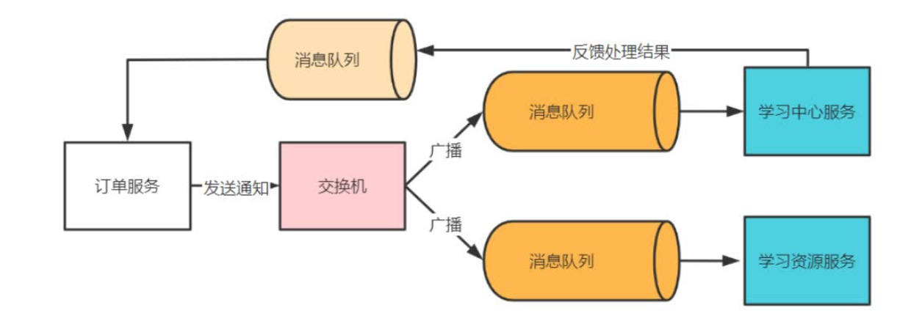

# 支付模块：

支付服务在整个系统是比较关键的服务。

支付模块是在登录模块和消息模块基础上的增值业务。

获取支付二维码的同时生成订单。

支付模块重点是下单的流程：

通过xxl-job 进行定时的消息队列管理：

支付成功后发送通知到RabbitMQ消息队列：

支付模块完成后，将支付内容发送到支付队列，学习模块是支付队列的消费者，拿到消费消息并将已经支付的课程添加到我的课程表里，并更新选课记录。

